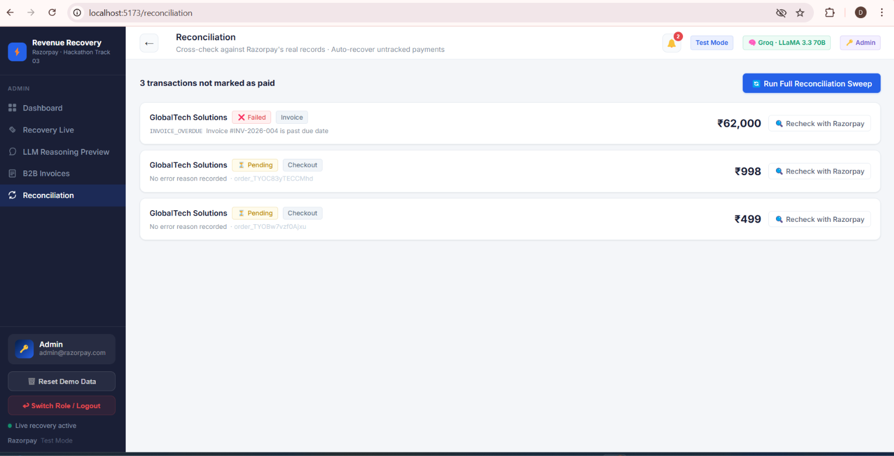
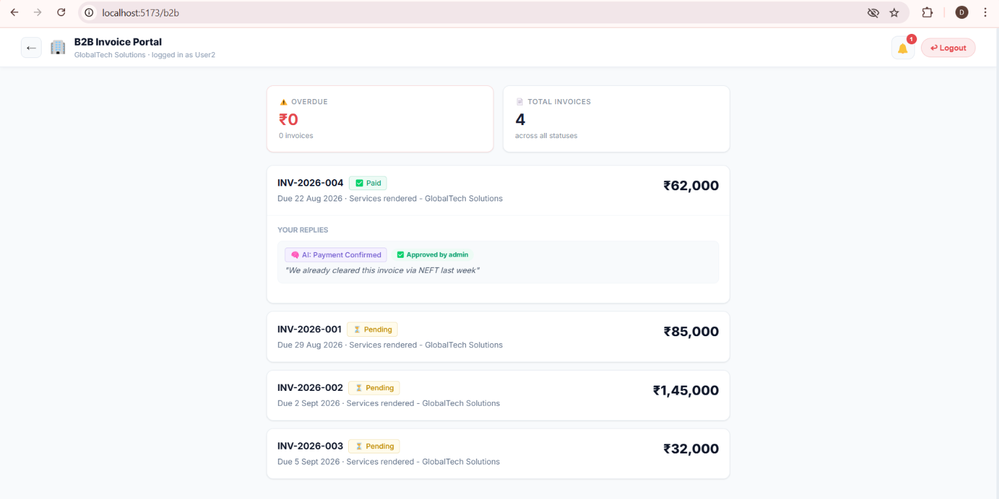

# AI Revenue Recovery Agent

**Razorpay Hackathon — Track 03: Recover Revenue Automatically**

An agent that detects revenue at risk — failed payments, checkout abandonment, overdue B2B invoices, and silent reconciliation gaps — diagnoses the real cause, and runs a bounded, governed recovery workflow to win it back automatically. Every number on the dashboard ties back to a real transaction and a real audit-trail entry.

Solo submission.

---

## What it does

When a payment fails, revenue isn't gone — it's just unrecovered. This agent:

1. **Detects** the failure the moment it happens (real Razorpay checkout events, not polling).
2. **Diagnoses** the cause — a rule table resolves ~80% of cases instantly; the rest go to a Groq LLM to reason over the customer's history.
3. **Decides** the right response on an escalation ladder that starts as quiet as possible and only climbs if it has to.
4. **Acts** — silently retries, sends a personalized nudge, asks for in-app verification, opens a full AI conversation, or escalates to voice/human — always inside governance guardrails (retry caps, contact caps, opt-outs, RBI pre-debit notice compliance).
5. **Proves it** — a live dashboard tracks ₹ at risk vs. ₹ recovered, broken down by escalation level and category, with a full audit trail.

## The escalation ladder

| Level | What happens | When |
|---|---|---|
| **L1 — Silent** | Fixed in the background, customer never sees it | Infra glitches, or a backup payment method exists |
| **L2 — Nudge** | A WhatsApp-style message with a real payment link | Declined or expired card, generic ambiguous failures |
| **L3 — In-app verify** | Ask the customer to confirm it was really them | Possible false fraud block |
| **L4 — AI conversation** | A full back-and-forth with the recovery agent | A nudge alone wasn't enough |
| **L5 — Escalation** | Voice call or human handoff | High-value, repeatedly-failing cases |

## Screenshots

### Admin Dashboard
Live recovery funnel, event stream, and audit trail — every ₹ at risk and ₹ recovered ties back to a real transaction.


### Recovery Live
Trigger real failed transactions and watch the full pipeline — diagnosis, decision, governance, action — run live.


### Customer Storefront
The real checkout experience: genuine Razorpay Checkout.js widget, real test-mode declines, and a proactive AI recovery chatbot sitting on the customer's own screen.


### Reconciliation
Catches the case where a payment genuinely succeeded on Razorpay's side but the internal record never learned about it — checks Razorpay's real API as the source of truth and shows the actual field-by-field diff, not a narrative.



### B2B Invoices
Business customers reply in plain English; the AI classifies intent (promise to pay, dispute, confirmation) but never auto-applies — a human always approves before the invoice changes.




### Home


## Tech stack

- **Backend**: Node.js, Express, MongoDB (Mongoose), Socket.io for live sync
- **Frontend**: React (Vite), Recharts, Socket.io client
- **AI**: Groq (LLaMA 3.3 70B) for ambiguous-failure diagnosis, recovery messages, and conversational recovery
- **Payments**: Real Razorpay integration — Orders API, Checkout.js widget, signature-verified callbacks

Nothing in the payment flow or the AI reasoning is mocked — rules only handle the ~80% of cases that don't need judgment, as a cost/speed decision, not a shortcut.

## Running it locally

**Backend**
```bash
cd server
npm install
npm run seed   # seeds a demo customer + products
npm run dev
```

**Frontend**
```bash
cd client
npm install
npm run dev
```

**Environment** — create `server/.env`:
```
PORT=5000
MONGODB_URI=<your MongoDB connection string>
GROQ_API_KEY=<your Groq API key>
CLIENT_URL=http://localhost:5173
RAZORPAY_KEY_ID=<your Razorpay test-mode key id>
RAZORPAY_KEY_SECRET=<your Razorpay test-mode key secret>
```

Without a Razorpay key configured, checkout falls back to a simulated success/failure prompt so the demo still runs end to end.

## Governance guardrails

- Max 3 retries per transaction
- Max 5 customer contact touches
- Opt-outs always honored, no exceptions
- RBI pre-debit notice enforced before any e-mandate auto-debit retry
- Any dispute intent auto-halts automated recovery and flags for human review
